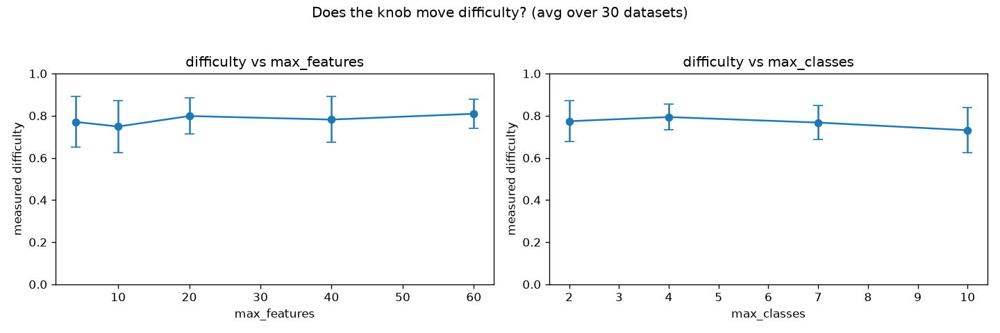
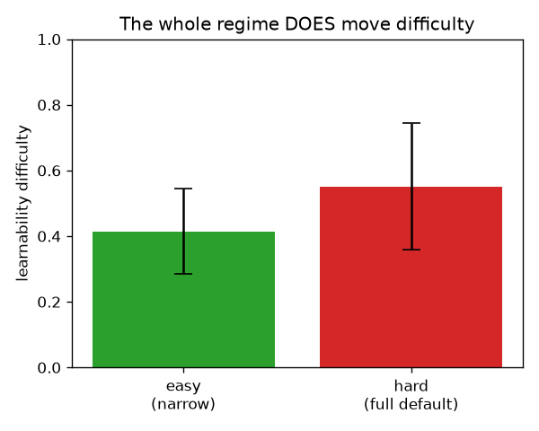
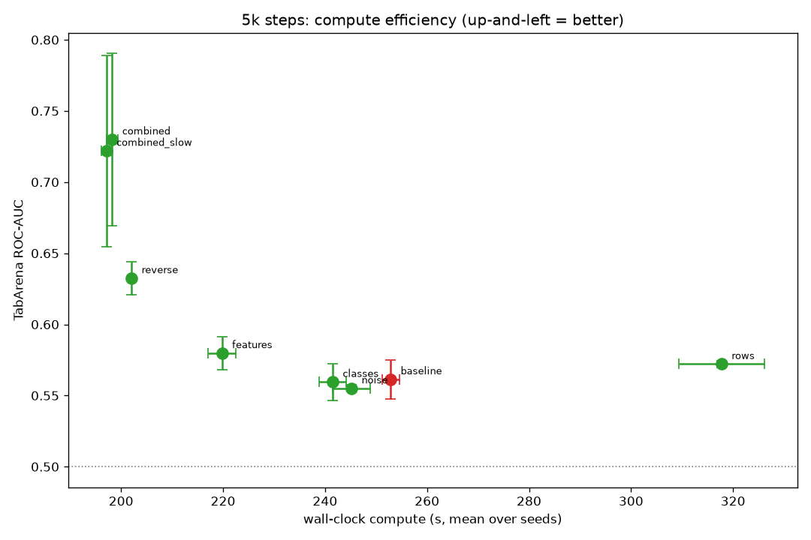
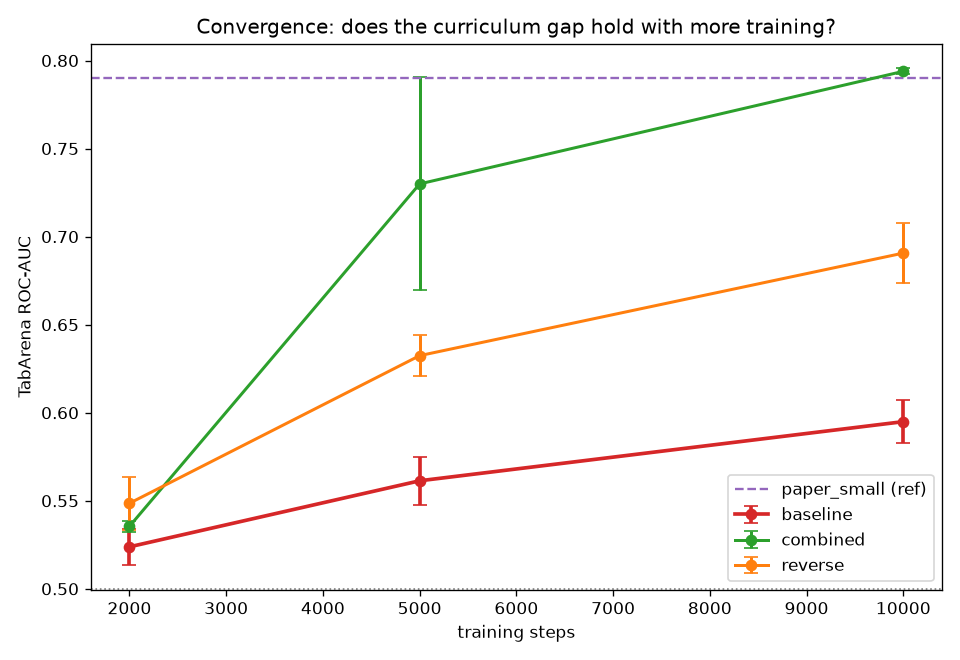
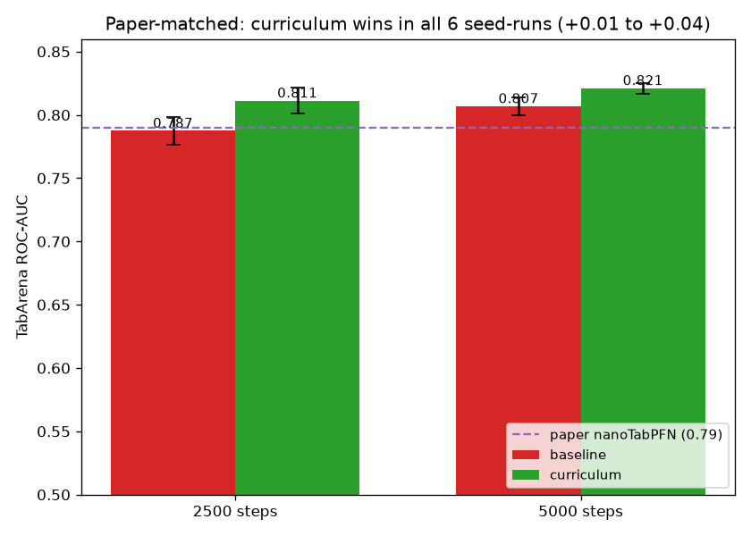
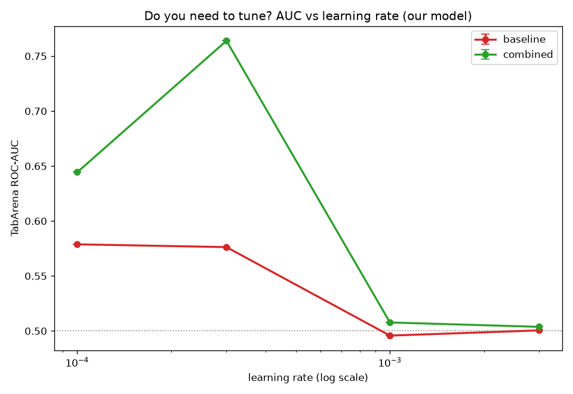

# Teaching nanoTabPFN, easy things first

**Curriculum pretraining for nanoTabPFN — ML Lab 2026, University of Freiburg**
Team: Parsa · Emre · Omid · Model: nanoTabPFN · Prior: TabICL · Eval: TabArena (ROC-AUC)

Does showing a tabular foundation model **easy synthetic datasets before hard ones** help it train?
This is the full story — what we tried, what broke, and what we found.

| | |
|---|---|
| **What difficulty is** | whole-regime — no single knob controls it |
| **Tuned comparison** | curriculum wins **+0.02 AUC**, all 6 seed-runs |
| **Under-tuned model** | curriculum wins **+0.19 AUC**, and lr can't rescue the baseline |
| **Compute** | easy data is cheaper to train on |

---

## 1 · The question — does the order of training data matter?

nanoTabPFN is pretrained on an endless stream of synthetic tables (from the TabICL prior), shown in
**random** order. Curriculum learning says: present them **easy → hard**, like teaching a person. We ask
whether that trains the model faster, or to a better final quality.

---

## 2 · First problem — what even makes a dataset "hard"?

Before ordering by difficulty, we had to *measure* it. Our first idea — how separated the class clusters are
geometrically — **saturated**: every dataset looked equally hard. We switched to a **learnability** probe: how
badly a cheap kNN does on the dataset. Then we swept each prior knob one at a time.

> **What we learned:** no single knob controls difficulty. But turning *all* of them down together (a "narrow"
> prior) vs the full prior does move it clearly:

> **Decision:** our curriculum ramps the **entire prior regime** at once (features, classes, noise, MLP depth,
> width, causes, dataset size) — not any single knob.

---

## 3 · Building it — a scheduler that rewrites the prior mid-training

We built a scheduler that changes the prior's knobs at set training steps and advances itself as the training
loop pulls batches — so nanoTabPFN's own training code stays untouched. Scenarios: a **baseline** (random full
prior), **combined** (easy→hard), **reverse** (hard→easy), and single-knob ablations.

---

## 4 · Our first mistake — the training-loss trap

Our first runs looked exciting: the **reverse** curriculum had the lowest training loss, so it "won." But that
was an illusion — a run that *ends* on easy data gets a low loss for free, because it's being tested on easier
batches, not because it learned more.

> **The fix:** never compare training loss across schedules. We score every model on **one shared fixed
> validation set** — the same datasets for everyone — so the numbers mean the same thing.

A second early trap: at 2000 training steps every model scored ~0.52–0.55 on TabArena — barely above random. At
that scale the "best" scenario is just noise. Lesson: **don't compare undertrained models.** We trained longer.

---

## 5 · A useful angle — easy datasets are cheaper to train on

Small, easy datasets cost less compute per step, so a curriculum front-loads cheap work. Plotting performance
against wall-clock, the curricula sit **up-and-left** of the baseline — better, for less compute.

> **Nuance:** only knobs that shrink the *data* save compute (features, dataset size); noise and class-count
> don't. One surprise: shrinking rows actually cost **more** — small datasets are generation-bound on the GPU,
> not compute-bound.

---

## 6 · Scaling up — train longer, and the gap opens

We trained to 5000 and 10000 steps. The models finally escaped near-random, and the curriculum's lead over the
baseline **grew** with training: at 10k, combined reached **0.79** while the baseline crawled to **0.60**.

> **But we paused:** a +0.20 gap is *large*. Before believing it, we asked the obvious question: **was our
> baseline actually any good?**

---

## 7 · Our second mistake — you can't transplant a learning rate

We compared to the nanoTabPFN paper and found it uses a **much higher learning rate (3.9e-3**, vs our 1e-4) and
a **smaller model**. So we tried the paper's learning rate on *our* bigger model — and training **collapsed to
random (0.50)**.

> **What we learned:** a learning rate is tuned **to a model**. The paper's lr is right for their small model and
> too aggressive for our bigger one. Lesson: match the model when you borrow a recipe.

---

## 8 · Doing it right — matching the paper; curriculum still wins, but small

So we used the paper's **model and recipe exactly**, adding only the curriculum. Now everything works — both
reach the paper's quality (~0.79) — and the curriculum wins by a small but **perfectly consistent** margin:
positive in **all 6 seed-runs**.

> **Result:** against a **well-tuned** baseline, the curriculum's honest advantage is **small (+0.02) but real
> and consistent** — comparable to the published model.

---

## 9 · The reality check — was the big win just an under-tuned baseline?

That leaves the +0.20 from step 6. Was our big-model baseline simply badly tuned? We swept its learning rate.
The answer is sharp: the **baseline caps at ~0.58 for every working learning rate** and can't be tuned up —
while the curriculum reaches 0.76. Above lr 1e-3, both collapse.

> **What we learned:** the big-model win is **not a learning-rate artifact** — but lr also isn't the bottleneck.
> The baseline is limited by something else.

---

## 10 · Where we are — curriculum helps weak baselines most

Putting it together, the size of the benefit tracks **how good the baseline already is**:

| Setting | baseline | + curriculum | gain |
|---|---|---|---|
| Paper's small model, tuned | 0.79 | 0.81 | **+0.02** |
| Our big model, batch 1 | 0.58 | 0.76 | **+0.19** |

The curriculum **lifts a lazily-configured model (0.58) nearly up to a carefully-tuned one (0.79)** without
careful tuning. That's a genuinely useful property. The most likely remaining limiter of the big-model baseline
is the **batch size** (it ran at 1; the tuned small model used 32) — the one variable we haven't isolated yet.

> **Open question:** is the big model's 0.58 ceiling from the **batch size** or the model size? One sweep away
> from the complete picture.

---

## 11 · Next — to finish the story

- A **batch-size sweep** on the big model — isolates the last confound.
- **More seeds** to tighten the tuned-setting margin.
- The framing we're most curious about: does the curriculum stay strong across a *wide range* of settings while
  the baseline needs exact tuning — i.e. does **curriculum reduce the need to tune?**

---

*Interim results. All code, configs and figures are in this repository.*
